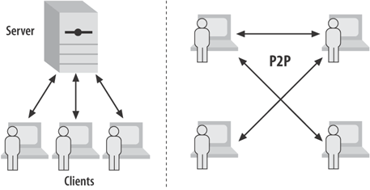
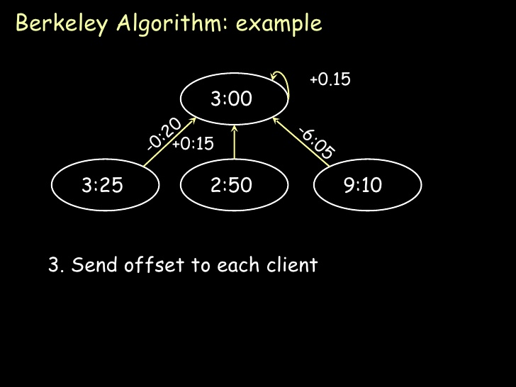

# Introduction

Video games have become an important aspect of people's lives as they provide an escape from reality and life's problems. In the last year or so, a new genre of video games, battle royale, has taken the world by storm. Video games of this genre, like Fortnite and PUBG, are effectively last-man standing games: the last surviving player wins. These games typically involve altercations between players and heavy interaction with the game map. These features place a lot of demands on maintaining the game state, such as ensuring the validity and consistency of the world as it is modified and making sure that eliminated players are unable to further modify, but may view, the game state. In addition, as with any network game, there should be very low latency.

We're interested in building a distributed 2D game of the battle royale genre for our term project. We feel that this area is interesting because it introduces real-time constraints into our distributed system. As mentioned before, such a game requires low latency. Whereas the blockchain, for example, could afford to take ten minutes to confirm transactions, players will expect near-instantaneous interaction. In addition, we intend for our game to store a lot of distributed state. 

# Background

When building an online real-time multi-player game, there are two popular architectures, shown in Figure 1. The first is a peer-to-peer architecture in which all clients start in the same initial state and each client broadcasts every move to all other nodes. With clients communicating in this manner, the gamestate cannot advance until each client’s move is received by every other client. The overall latency of the system is then dependent on the slowest client in the system. This system also does not handle faulty clients well, as each client will wait and decide themselves if a client has failed. The second possible architecture is the client-server architecture. In this architecture the gamestate is stored on a server and clients send updates to the server. This architecture reduces latency, because for each client the latency is determined by the connection between that client and the server. However, this architecture is still too slow for real-time online multi-player games, which is why the idea of client-side prediction was introduced. Client-side prediction allows the client to simulate its own version of the game whilst sending the results of the moves to the server. This essentially means that each client maintains its own gamestate, but this can be overridden by the server. This architecture allows for the server to detect malicious clients as well because each action by the client is validated by the server.

{width=75%}

However, both of these architectures are too slow, so we will build a peer to peer model, where the server does not participate in communications between players. We will be making use of the client prediction aspects of the second architecture, but not the client-server model.

\pagebreak

# Game Mechanics

The minimum possible game that we can build involves players moving around, aiming, and firing within a static, fixed-size map. We'll start with that, and build our way up by adding stage hazards, more player interactions, health, lives, more weapons, and any number of other features.

## Network Architecture

This game will be peer to peer. The server exists for peer discovery, but does not participate in communication between players otherwise.

When players make moves, the whole network has to find out about them. The simplest possible configuration is to have every player connected to every other player, and to have all players send all their moves to every other player every time they make a move. By using clock synchronization, and a stable tie breaker such as random number generator, we can ensure a global serial order of events. Whenever a player makes a move, they send their new position to the other players, and whenever they fire they send their position and angle that they are firing at.

Clients might be malicious, which means that every client has to validate the state at every step. With only movement and firing, those checks are reasonably simple. Each client verifies that the new position of a player is within the allowed movement speed, and that the position from which a player fires matches the players current position. Every client will likely have to keep events around in a buffer for a short while, to ensure that they only process events and update their state once there is a high likelihood that a global order has been reached.

Once we have those features built, we'll work on more interesting network topologies, like those that we built for project one. We'll also work on adding other kinds of interactions, and on optimizations to improve latency. Those optimizations might involve relaxing the global order requirement, and instead only ordering events that interact with eachother.

## Packet Loss

We'll use UDP to communicate between clients. This means low latency, but it also means that packets might get lost. This makes validation more complicated: what if we lose two moves a player makes, and then only receive the third one? We'll have to reason about the likelihood that a certain update is valid, given the missing data. We can't be entirely sure about this update, but with the whole network put together and over time, even with lost packets, we can establish an ordering of actions.

## Gameplay

We plan to build a game not unlike Tanks (Battle City), where players can move around and shoot at each other. The last player standing wins. Initially, our game will be very simple, without any health or stage hazards or anything. We'll grow our game mechanics as time goes on, adding things like stage hazards, status effects, and alternative goals. With this approach, we can grow the complexity to an almost arbitrary degree by adding features, but we can also scale back our ambitions if we run out of time. 

## Peer Discovery

We'll start with a central server to keep track of peers, much like in project one. Our server will eventually back the state of the game map, so that even if no players are connected, the world state is preserved.

## Clock Synchronization

As the game is a real-time distributed system, we need to synchronize the clocks of all the clients so that we can then order the events of multiple clients and resolve the altercations between players. We are planning to use the Berkeley Algorithm to synchronize clocks, with the server chosen as the master for the purposes of this algorithm. This algorithm is shown in Figure 2.

## Player Disconnections

Players will send heartbeats to the other players that they are connected to. This will not scale well if each player is connected to every other player, but we can use our server to connect clients in more interesting topologies, such as a hypercube or taurus. We'll choose hypercube for our network. This topology has a higher number of average connections between any two distinct sets of nodes. In this configuration, players still send heartbeats to all the other players they are connected to, but those heartbeats won't be flooded throughout the entire network. Instead, only once a player detects that one of the players it is connected to disconnects will it flood an explicit disconnection message to the network. This means that every client will have to maintain a graph of the network topology to detect partitions, but since each client also has to keep track of the world state, it's an acceptable cost.

## Partition Detection

At times, network links might break such all the nodes are now no longer strongly connected. We'll assume that nodes can reach each other if they can reach the server, because otherwise the server has to participate in communication between clients. In order to increase the distributed complexity of our project, we'll focus on the case where nodes are not behind a network address translation router. Since nodes only flood disconnection events for their immediate peers, each node has to maintain an internal representation of the network topology, so that it can determine if a node disconnecting partitions the network.

## Stat Collection

Stats are an important feature of any shooter game, especially a battle royale game, as it allows the players to see how well they are performing. We plan to keep track of player stats, such as their kill/death ratio among others, by maintaining a distributed key-value store using Conflict-Free Replicated Data Types. Here the key would be the unique username of the player, and the value would be the interesting stats we would like to provide. This will provide a dimension of distributed systems design that is less latency-bound than the other game mechanics.

TODO VAS ADD SOME PICTURES

The operations on the stats that we will provide are as follows:

* __get(username)__ : Contact the server to get the updated stats of a particular player

* __add(username, stats)__ : Request the server to add a new pair of username, stats to the store

* __update(username, stats)__ : Request the server to update the statistics of a particular player

## Cloud as a Persistent Service Provider

We'll have a centralized server for peer discovery, which will be hosted on Azure. We also plan to have a "backup" client on Azure, so that the game is playable by a single client as well.

## Technology stack

We'll use Go for nearly everything. We'll also use a simple 2D game engine, Pixel, so that we don't devote too much time to graphics (https://github.com/faiface/pixel).

## Limitations and Assumptions

* The server will only host 1 game session at any point of time. We can always scale this up in the future.

* The number of players that can join a game session will be limited to 10.

## Stretch Goals

* Extend the game to have more features, such as stage hazards, status effects, and alternative goals - all of which would require a more complicated distributed state than our initial design.

# Development Plan

| Deadline | Task |
| :-------    | :------------------------------------------------------------ |
| Mar 2    | Project Proposal Draft Due |
| Mar 9    | Project Proposal due; finalize external libraries being used; develop a MVP for the game; learn about dinv, GoVector and ShiViz |
| Mar 16   | Implement peer discovery, clock synchronization, and a basic version of the game that allows players to join and control their tanks |
| Mar 23   | Implement shooting models and complete the game so that it has a winner; also implement basic version of stats collection | 
| Mar 30   | Implement additional features for the game as time permits |
| Apr 6    | Stress-test the game with a mix of malicious and non-malicious users; complete report with Dinv, GoVector, and ShiViz |
| Apr 9-20 | Project Demo on a date TBD |

## Testing Plan

We'll approach testing in the same way that many enterprises do. We'll write our implementations against abstract interfaces, so that dependencies are inverted. By doing this, we can mock out the dependencies in various parts of the code and test various scenarios. We'll keep track of code coverage and make sure to have test coverage for at least 80% of our code.

# SWOT Analysis

## Strengths

* Team members have worked with each other on the previous assignments of the course.

* Team members are diligent and punctual.

* All members are good at researching, as well as solving potential issues.

* Vaastav knows Stewart who wrote Dinv and is familiar with ShiViz and GoVector.

## Weaknesses

* There are limited resources available for building a low-latency distributed game.

* None of the members have any prior experience with making multi-player online games.

## Opportunities

* If time permits, we can increase the complexity of the game and expand our intended distributed system.

* Conflict-Free Replicated Data Types is a new concept for all of the members and will require a lot of work to implement properly.

## Threats

* Commitment to exams or assignments from other courses may interfere with progress.

* None of us have any experience with GoVector, ShiViz, or Dinv, all of which we are aiming to incorporate into our project.

# Resources

<https://www.cs.ubc.ca/~gberseth/projects/ArmGame/ARM%20Game%20With%20Distributed%20States%20-%20Glen%20Berseth,%20Ravjot%20%20%20%20%20%20Singh.pdf>

<http://www.it.uom.gr/teaching/distrubutedSite/dsIdaLiu/lecture/lect11-12.frm.pdf>

<https://www.microsoft.com/en-us/research/uploads/prod/2016/12/Time-Clocks-and-the-Ordering-of-Events-in-a-Distributed-System.pdf>

<https://en.wikipedia.org/wiki/Berkeley_algorithm>

<http://pmg.csail.mit.edu/papers/osdi99.pdf>

<https://en.wikipedia.org/wiki/Conflict-free_replicated_data_type>

<https://en.wikipedia.org/wiki/Battle_City_(video_game)>

<https://github.com/faiface/pixel>
