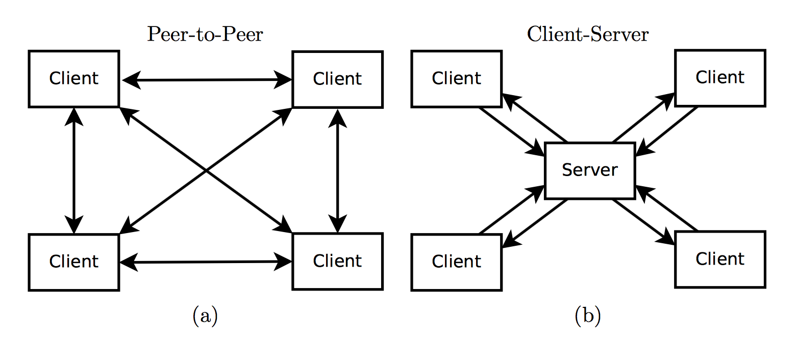

# Introduction

Video games have become an important aspect of people's lives as they provide an escape from reality. Recently, a new genre of video games, battle royale, has become increasingly popular. Video games of this genre are effectively last-man standing games – the last surviving player wins. These games typically involve altercations between players and heavy interaction with the game map. Such features place a lot of demands on maintaining the game state, such as ensuring the consistency of the world as it is modified and making sure that eliminated players are unable to further alter, but may view, the game state. In addition, as with any network game, there must be very low latency.

We are interested in building a distributed 2D game of the battle royale genre for our term project. Players will move, aim, and fire, within a shared, fixed-size map; the last player standing wins. We feel that this concept is interesting as it introduces real-time constraints into our distributed system. As mentioned above, such a game requires low latency. Whereas the blockchain, for example, could afford to take ten minutes to confirm transactions, players will expect near-instantaneous interaction. Moreover, we intend for our game to store a great deal of distributed state.

# Background

When building an online real-time multi-player game, there are two popular architectures, shown in Figure 1 [1]. The first (a) is a peer-to-peer architecture in which all clients start in the same initial state and then broadcast each of their moves to all other nodes. With clients communicating in this manner, however, the game-state cannot advance until each client’s move is received by every other client. The overall latency of the system is then dependent on the slowest client in the system. In addition, such a system does not handle failing clients well, as each client must wait and decide if a client has failed.

The second (b) common architecture is a client-server architecture. In this architecture the game-state is stored on a server and clients send updates to the server. This architecture reduces latency, as latency for each client is determined by the connection between that client and the server. A client-server architecture of this kind is still too slow for real-time online multi-player games, however. This is why the notion of client-side prediction was introduced. Client-side prediction allows a client to simulate its own version of the game while sending the results of its moves to the server. In effect, each client maintains its own game-state. The server may then override that state, as it validates each client action.   

{width=75%}

\pagebreak

# Proposed Design

## Network Architecture

For our purposes, architectures (a) and (b) as outlined above are too slow. We will thus combine aspects of the two architectures. We will use peer-to-peer communication as in architecture (a), but each player node will only broadcast their state to a subset of the network, much like the miners did in project 1. There will also be a server, as is the case in architecture (b). However that server will not participate in communication between player nodes. Instead, it will exist solely for the purposes of peer discovery and clock synchronization (detailed below). Moreover, player nodes will employ client-side prediction as is used in architecture (b).

## Peer Discovery

The server, which will be hosted on Azure, will exist for the purpose of (1) assigning a unique id to new players, and (2) providing the addresses of nodes in the network, similarly to the server in project one. When a player node joins, it will receive addresses for a subset of all player nodes from the server. The player node will then maintain a minimum number of peers, making requests to the server for more peers as needed. In addition, there will be a 'backup' of the game-state stored on Azure as well.

## Peer-to-Peer Communication

When a player moves or shoots, the entire network must know. Thus, a player node will broadcast its updates to its known set of peer nodes, which will then broadcast it to theirs and so on, thereby flooding the update to the network. As noted above, this mirrors the way in which new blocks were shared among all miner nodes in project 1. Moreover, each player node will validate each received update. As our game consists only of moving and firing, those validation checks will be simple. A player node will verify:  
(1) That the updated position of another player is within the bounds of the permitted movement speed.  
(2) That the position from which a player fires matches that player's current position.  
(3) That the player is not dead (i.e. has greater than 0 health)  
In this context, a 'malicious' player node would be one that emits updates that violate these requirements. Thus these verifications will guard against malicious nodes and throw out any illegal game updates.  

We will use the User Datagram Protocol (UDP) for communication between player nodes. This will give us lower latency, however it also opens up the risk that packets may be lost. This complicates validation. What if, for instance, we lose the first two moves that a player makes and only succeed in broadcasting the third? In validating player actions, we will therefore reason about the probability that a particular action legally occurred.

## Clock Synchronization

Given that our proposed game is a real-time distributed system, with each player broadcasting its moves and shots, we need a method by which to order the updates of multiple player nodes and thereby resolve altercations between players. We will use clock synchronization among all player nodes, along with a random ID as a tie-breaker, to ensure a global serial order of events. So as to ensure that a player node does not process a received event and update its game-state before an ordering has been determined, player nodes will buffer events for 1 second.  

More specifically, we will use the Berkeley Algorithm to synchronize clocks, with the server chosen as the master for the purposes of this algorithm [4]. This algorithm is shown in Figure 2 below.

{width=75%}

## Player Disconnections

Player nodes will receive heartbeats from the set of clients that they received from the server upon joining. Were each node connected to every other node, this would scale poorly. However, as is detailed above, player nodes will only be connected to a subset of all nodes. Thus, a player node will receive heartbeats from the nodes it is connected to, but those heartbeats will not be flooded throughout the entire network. Only once a player node detects that one of its peers has disconnected will it then flood a disconnection notification throughout the network. That player would then no longer be visible by any client on the game map.

If a previously disconnected node succeeds in reconnecting, the player node should then be able to resume the game with its previous state. This is because that player's last position and accompanying stats are stored by that player node and across all nodes, mapped to its server-assigned id. The reconnected player would then be visible again on the game map. While transitory disconnections will be handled by our system, as is described here, the failure of a player node would require it to rejoin as a new player.      

## Peer-to-Peer API

The API for communication between player nodes will be defined as follows:

* __err ← RegisterPeer(address)__ : Notifies a player node of a peer that it should begin sending heartbeats to at `address`.

* __err ← Heartbeat()__ : Player nodes listen for heartbeats from the subset of nodes that they are connected to. A player node expects to receive a heartbeat every 2 seconds.

* __err ← NotifyFailure(playerId)__ : Notifies that the player node with id `playerId` has disconnected. The player node receiving this call will flood it to its peers.

* __err ← NotifyEvent(playerId, event)__ : Notifies that the player node with id `playerId` has either moved or fired. The player node receiving this call will flood it to its peers.

## Stat Collection

As in any shooter game, stats are important for a player to see how well they are fairing. We intend to track a number of player stats, including their health and kill/death ratio. To do so, we will maintain a distributed key-value store using conflict-free replicated data types [6]. The key will be the unique player id and the value the stats we would like to provide and maintain. This will add a dimension to our distributed system design that is less latency-bound than the other specifications outlined above.

*TODO VAS ADD SOME PICTURES*

The operations on the stats that we will provide are as follows:

* __stats, err ← Get(playerId)__ : Contact the server to get the updated stats of a particular player

* __err ← Add(playerId, stats)__ : Request the server to add a new pair of username, stats to the store

* __err ← Update(playerId, stats)__ : Request the server to update the statistics of a particular player

## Limitations and Assumptions

* A player node can always reach the server, for the purposes of peer discovery.

* The server will only host 1 game session at any point of time.

* There will be no network partitions.

* The number of player nodes that can join a game session will be limited to 20.

## Stretch Goals

* __Handle network partitions:__ A network is partitioned if one subgraph of the network is no longer reachable from another subgraph. Partitions are particularly problematic for a distributed game such as this, as it results in one subset of players' updates not appearing in another subset of players' game. Handling partitions raises two seemingly complex questions: (1) how will nodes detect that there is a partition, and (2) how will nodes know which nodes to connect to so as to resolve the partition?

* __Increase the number of player nodes:__ We have initially limited the maximum number of player nodes to 20 because we think that no more than that number of players could reasonably be depicted on a single map. To increase the number of player nodes, we would need to: (1) expand the map and (2) have only a local subsection of the map visible to a player. This would, we think, mostly entail frontend changes but would be interesting inasmuch as it would enable us to expand the size of the system.  

## Technology stack

Go will be used for most, if not all, aspects of this project. So as to avoid devoting too much time to the frontend of the application, we will also use a simple 2D game engine, Pixel [8].

# Development Plan

| Deadline | Task |
| :-------    | :------------------------------------------------------------ |
| Mar 2    | Project Proposal Draft Due |
| Mar 9    | Project Proposal due; finalize external libraries being used; develop a MVP for the game; learn about dinv, GoVector and ShiViz |
| Mar 16   | Implement peer discovery, clock synchronization, and a basic version of the game that allows players to join and control their tanks |
| Mar 23   | Implement shooting models and complete the game so that it has a winner; also implement basic version of stats collection |
| Mar 30   | Implement additional features for the game as time permits |
| Apr 6    | Stress-test the game with a mix of malicious and non-malicious users; complete report with Dinv, GoVector, and ShiViz |
| Apr 9-20 | Project Demo on a date TBD |

## Division of Labour

Outlined below are the tasks for which each group member will be responsible. Some tasks will be shared between two members. Testing will be handled by all four members.

### Vaastav Anand

* Implement CRDT for stat collection.

* Implement clock synchronization amongst the players and the server.

* Include and use Dinv, GoVector and ShiViz in the project.

### Madeleine Chercover

* Implement the peer-to-peer API.

* Write the final report.

### Raunak Kumar

* Implement CRDT for stat collection.

* Include and use Dinv, GoVector and ShiViz in the project.

### Jerome Rasky

* Implement initial server for client discovery.

* Implement the front-end of the game and the gameplay.

* Implement the peer-to-peer API.

## Testing Plan

We intend to approach testing in the same way that many enterprises do: by writing our implementations against abstract interfaces so that dependencies are inverted. In doing so, we can then mock out the dependencies in our code and test multiple scenarios. We will track code coverage and ensure test coverage for at least 80% of the code.

More specifically, we will mock out dependencies locally and then test that the game-state updates as expected when, for example:
* The player moves
* The player shoots, and no other player is in the path of its shot
* The player shoots and one or more players are in the path of its shot
* The player is shot by another player
In addition, we will test that the game state correctly handles malicious node updates, such as when:
* A player sends an update saying that it shot along an invalid trajectory based on its position
* A player sends an update saying that it moved to a position that is unreasonable given its last known position
Finally, we will also test transitory disconnections.

# SWOT Analysis

## Strengths

* Team members have worked with each other on the previous assignments of the course.

* Team members are diligent and punctual.

* All members are good at researching, as well as solving potential issues.

* Vaastav knows Stewart, who wrote Dinv and is familiar with ShiViz and GoVector.

## Weaknesses

* There are limited resources available for building a low-latency distributed game.

* None of the members have any prior experience with making multi-player online games.

## Opportunities

* If time permits, we can increase the complexity of the game and expand our intended distributed system.

* Conflict-Free Replicated Data Types is a new concept for all of the members and will require a lot of work to implement properly.

## Threats

* Commitment to exams or assignments from other courses may interfere with progress.

* None of us have any experience with GoVector, ShiViz, or Dinv, all of which we are aiming to incorporate into our project.

# Resources

[1] <https://www.cs.ubc.ca/~gberseth/projects/ArmGame/ARM%20Game%20With%20Distributed%20States%20-%20Glen%20Berseth,%20Ravjot%20%20%20%20%20%20Singh.pdf>

[2] <http://www.it.uom.gr/teaching/distrubutedSite/dsIdaLiu/lecture/lect11-12.frm.pdf>

[3] <https://www.microsoft.com/en-us/research/uploads/prod/2016/12/Time-Clocks-and-the-Ordering-of-Events-in-a-Distributed-System.pdf>

[4] <https://en.wikipedia.org/wiki/Berkeley_algorithm>

[5] <http://pmg.csail.mit.edu/papers/osdi99.pdf>

[6] <https://en.wikipedia.org/wiki/Conflict-free_replicated_data_type>

[7] <https://en.wikipedia.org/wiki/Battle_City_%28video_game%29>

[8] <https://github.com/faiface/pixel>

[9] <https://www.cs.helsinki.fi/webfm_send/1232>
