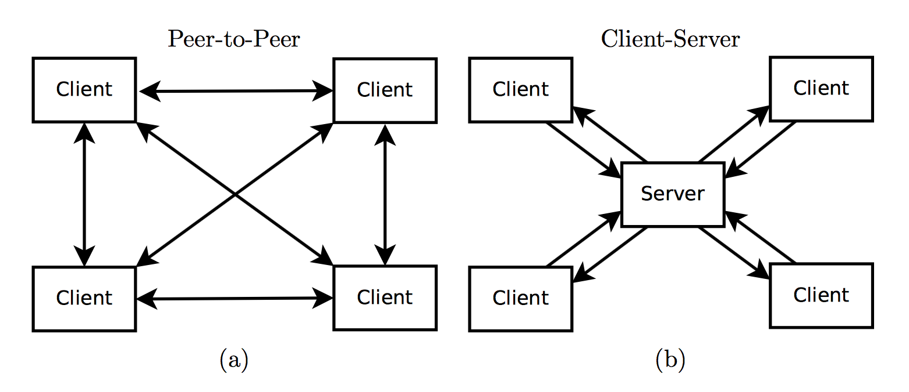
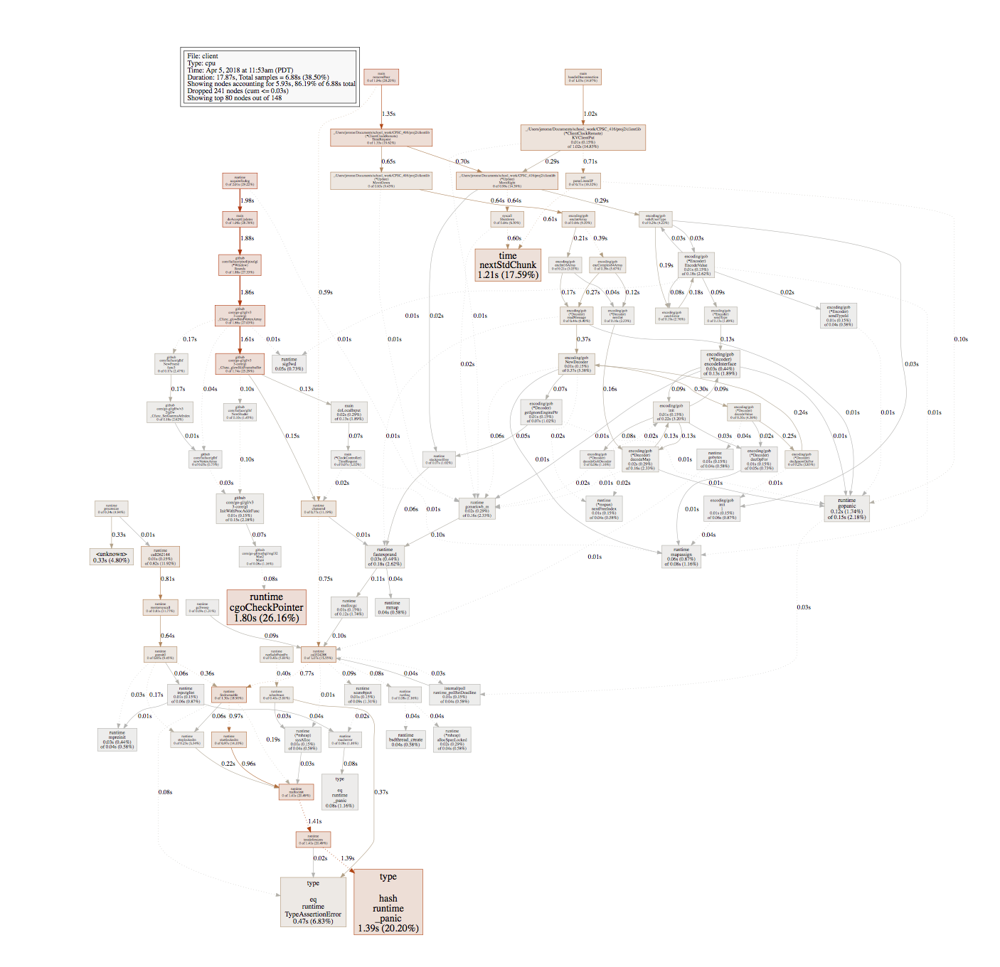

# Introduction

In recent years, a new genre of video games, often termed as 'battle royale', has become increasingly popular. Games of this genre are, in effect, last-man standing games – the last surviving player wins. Such games involve frequent altercations between players and consequently place heavy demands on how the game state is maintained. The world must appear consistent for all players as it is modified, interactions between players must be resolved fairly, and eliminated players should no longer be able to modify the game state.

For our final project, we built a distributed, 2D battle royale-style game. Players move, aim, and fire, within a shared, fixed-size map; the last player standing wins. In addition to being a popular source of entertainment, such games pose interesting challenges when designed and developed as a distributed system. Key among these challenges are (1) the amount of distributed state and (2) the requirement for low latency. Whereas a blockchain, for example, can reasonably take ten minutes to confirm transactions, players expect near-instantaneous interaction. We have sought to build our system with such requirements in mind.            

# Design

## Overview

When designing an online real-time multi-player game, there are two common approaches, shown in the figure below [1]. The first is a peer-to-peer architecture (a) in which all nodes broadcast each of their moves to all other nodes. The game state cannot advance, however, until each node's move is received by every other node. Thus, the latency of the system is determined by the slowest node. Moreover, such a system does not handle failing nodes well, as each must wait and decide if a node has failed. The second common approach uses a client-server architecture (b). In this design the game state is stored on the server and clients send updates the server. This reduces latency, as the latency for each client is determined solely by the connection between that client and the server.

{width=75%}

For our purposes, architectures (a) and (b) are both too slow. We have thus elected to use something of a hybrid design. Our system consists of two components: a server and player nodes, where each player node is associated with one player in the game. This is not a client-server architecture, however. Player nodes broadcast their game updates to a subset of all player nodes (their peers) which then broadcast the update to theirs, thereby flooding the update throughout the network. To address the latency issues outlined above with regards to architecture (a), player nodes do not wait for their updates to be broadcast to all other nodes, but instead update their local game state immediately. Such a design decision might come at the cost of consistency of game state across player nodes. But presuming that the emitted updates are valid and would eventually be accepted by all player nodes, any such inconsistency should be temporary (update validation is discussed in greater detail below).

The server does not participate in communication between player nodes. Instead it is responsible only for those functions which are not latency-sensitive or which require consensus. Those functions include peer discovery, player reconnection, clock synchronization, and a key-value store, and are discussed in more detail below.       

## Server

As discussed above, the communication with the server does not have the same requirement for low latency that broadcasting game updates between player nodes does. For this reason, communication with the server uses the Transmission Control Protocol (TPC). The server functions are as follows:

* __Peer Discovery__: The server returns a set of addresses of other player nodes in the network. The player then maintains a minimum number of peers, requesting more player addresses from the server as needed. On startup, player nodes must thus register their address with the server so that they are then discoverable by other nodes.

* __Player Reconnection__: When a player node disconnects, the server is notified of that failure. It then (1) stops returning the failed node's address in peer discovery and (2) begins monitoring that node in case it reconnects. In the event that the node reconnects, the server can then resume returning its address to other nodes. Node failure is discussed in more detail below.

* __Clock Synchronization__: Given that our game is a real-time distributed system, with player nodes broadcasting their moves and shots, we need a method by which to order updates and thereby resolve altercations between players. To do so, we use clock synchronization amongst all player nodes, and in particular the Berkeley Algorithm. For the purposes of this algorithm, the server is selected as master. Every time a new player connects to the server, the server requests all of its connected clients to return their actual time. After adjusting for the RTT delay, the server calculates the raw offsets of each client and then calculates the average time. After this the server calculates the relative offsets for each client (relative to the average) and asks each of them to set their clock offsets accordingly.

* __Key-Value Store__: Our system tracks the number of kills and deaths associated with each player, where the ID of each player node is associated with a set of statistics. To store and retrieve these statistics, we have used a centralized distributed key-value store, with the data replicated across player nodes. The role of the server in this functionality is akin to the server in the distributed file system of assignment 2. Stats collection and the key-value store is discussed in further detail below.

### Server API

With those functions in mind, the API for communication with the server is as follows:

* __success, err ← Register(address, tcpAddress, clientId, displayName, logger)__: Registers the given `clientId`, and associated `displayName` and addresses with the server. The client may then further interact with the server in the calls below.
* __PeerNetSettings, err ← Connect(clientId, logger)__: Marks the player node associated with `clientId` as connected, allowing its address to be returned to other nodes in calls to `GetNodes()` (defined below). Returns the network settings for the game, including the minimum number of peers that a player node should maintain.
* __success, err ← Disconnect(clientId, logger, useDinv)__: *TODO*
* __[]PeerInfo, err ← GetNodes(clientId, logger)__: Returns a set of addresses of player nodes that are currently marked as connected.
* __err ← NotifyFailure(clientId)__: Marks the player node associated with `clientId` as disconnected, so that it is no longer returned in calls to `GetNodes()`. The server then begins monitoring that node in the event that it reconnects.
* __value, err ← KVGet(key, clientId, logger)__: Retrieves the player statistics (that is, the number of deaths and kills) associated with player `clientId` from one of the player nodes where the key-value pair has been replicated.
* __err ← KVPut(key, value, logger)__: Adds the given key-value pair to the store, replicating the data across a subset of connected nodes. If the already exists, the value associated with that key is updated.

## Player Node

Each player node is associated with a single player in the game. Each node thus also has an associated application with which a user may view and interact with the game state. Whenever a user moves or shoots, the player node updates the local game state and broadcasts that update to its peers, who will then flood the update to all nodes in the network. In addition, player nodes monitor peers to ensure they have not disconnected, and notifies its remaining peers if one does.

To that end, a player node consists of six workers, illustrated in the figure below: a peer worker, which ensures that the node maintains the minimum number of connections; a listener worker, which listens for incoming game updates from the node's peers; a draw worker, which pushes valid updates to the graphical interface; an outgoing worker, which listens for input from the node's associated user and broadcasts those updates to the network; a heartbeat worker, which sends heartbeats every 2 seconds to the required peers; and a monitor worker, which monitors the frequency of the heartbeats the node is receiving.

{width=75%}

### Update Validation

As is noted above, player nodes validate received game updates prior to updating their local game state. Updates – that is, reported moves and shots – are validated according to the following requirements:
(1) That the receiving node does not have a more recent update from the player. This is done by using the timestamps from synchronized clocks that are sent along with every update.
(2) That the updated position of the player is within the bounds of the permitted movement speed.
(3) That the player associated with the update is not dead.
In this context, a 'malicious' player node is one that emits updates that violate these requirements. Thus, these verifications guard against malicious nodes and throw out any illegal game updates.

### Node Failures

Heartbeats, which are sent using TCP, are used for two-way connection monitoring amongst peers. Which player node initially calls `Register()` (defined below) determines which node among two peers will send heartbeats and which will receive them. One player node attempts to send a heartbeat every 2 seconds. The player node receiving the heartbeats records the time at which each heartbeat is received. Depending on whether the node is sending or receiving heartbeats, if either (1) the sent heartbeat returns with an error or times out, or (2) it has been longer than 2 seconds since the last heartbeat has been received, the node will test the connection. If the test returns with an error or times out, the node is considered disconnected. The failed node is removed from the peers list, as well as its sprite from the game, the server is notified so that it ceases returning the node as a viable peer, and finally, a notification of the node's failure is flooded throughout the network. Player nodes that receive the notification will then also remove the disconnected player from their local game.

The server monitors player nodes that have been reported as disconnected, regularly testing its connection to the node. In the event that a node is found to have reconnected, the server prompts the reconnected node to clear its peers list. The reconnected node will then behave as if a newly joined node, calling the server to get new peers. In this way our system handles transitory disconnections in addition to outright failures. Note, however, a case not handled by the current implementation: if node A disconnects transitorily and then node B disconnects afterwards, when node A reconnects it will display the player associated with node B in the application despite it being disconnected. This is because node A was disconnected at the time when node B's failure notification was propagated.

### Stats Collection

Our system tracks game statistics, including the number of deaths a player has suffered and the number of kills that a player has made. If a player is killed, the player that was hit increments their death count while the player that hit them increments their kill count. To do so, we have implemented a centralized distributed key-value store. As mentioned above, the store uses a centralized server to process value retrievals and updates from player nodes, much like the distributed file system in assignment 2. Here, the key in the store is the player ID and the value is a struct containing the player's game statistics.

Locally each player node creates a file for each key and store the value as the contents of that file. For example, to store a key-value pair with key = 5, the filename is `5.kv`. On startup, a player node sets up its local key-value store by reading any local files and storing them in a map. On a call to `KVGet()`, the server identifies the set of connected nodes with the required value pair. If there are no such nodes, the server returns a default value of 0 for deaths and kills respectively to the requesting node. Otherwise, the server retrieves the value from one of the connected player nodes. The node then responds with the value associated with the request key. On a call to `KVPut()`, if there are less than three connected nodes that have stored the key-value pair, the server selects additional nodes on which to replicate the pair. The server also notifies connected nodes storing the pair to update the value.

Ensuring that key-value pairs are stored across a minimum number of player nodes gives our system a degree of fault tolerance. In our current implementation, however, if the server attempts to retrieve a value from a player node and the node fails while processing that request, the server does not attempt to cancel its request and retrieve the value from another connected node that stores this pair. This could be fixed by adding a timeout, using channels to detect this scenario, and attempting to retrieve the value from another node.

### Player API

Given the speed at which game updates must be propagated from player to player, functions that affect user-visible game state use the User Datagram Protocol (UDP). The API for communication with player nodes is as follows:

* __err ← Register(clientId, address, tcpAddress)__: Notifies the player node to add `clientId` to its peer list and to begin sending heartbeats to `tcpAddress`.
* __err ← NotifyUpdate(clientId, update)__: Notifies the player node to update its game state with the given `update` and flood that update to its peers.
* __err ← NotifyFailure(clientId, ttl)__: Notifies the player node to mark the player `clientId` as dead in its game state, and to flood the failure notification to its peers unless `ttl` == 0.

The remaining portion of the player node API uses TCP, as these functions do not have the same requirements for low latency as the functions above. The decision to use a mix of UDP and TCP was made with the intention of reducing the risk of packet loss where possible.

* __time, err ← TimeRequest()__: The server node asks the player node for its local clock time so that it can calculate the relatove offsets for each player node.
* __err ← SetOffset(offset)__: The server node tells the player node to set the offset of its clock so that it is synchronised with the rest of the network.
* __err ← Heartbeat(clientId)__: Player nodes listen for heartbeats from the nodes on which they have called `Register()` (defined above). A player node expects to receive a heartbeat from each monitored peer every 2 seconds.
* __err ← Ping()__ : No-op call used to test the TCP connection between the caller and callee player nodes.
* __success, err ← Recover()__: Resets the state of a reconnected player node, closing any remaining connections and setting its peers list to zero.
* __value, err ← KVClientGet(key, logger)__: Retrieves the number of deaths and kills associated with the player with ID `key`.
* __err ← KVClientPut(key, value, logger)__: Stores the number of deaths and kills associated with the player with ID `key`.

# Implementation

## Azure

The server is hosted on Azure. In addition, a headless player node (i.e. one with no associated application) is hosted on Azure also. This node is our game's bot; it automatically generates moves and fires at other players. It cannot die, so that players are never without opponents.

## Library Dependencies

Our implementation is written under Go 1.9.2. In addition to the standard library, this project uses the following external libraries:

* Pixel: a 2D game library in Go.
* GoVector: generates a ShiViz-compatible vector-clock timestamped log of events.
* DinvRT: generates a ShiViz-compatible vector-clock timestamped log of events as well as traces of dumps from the system runs which can be used for invariant detection.

# Evaluation

## Testing

### Testing-Overview

Our system was tested by running player nodes and playing the game manually. In addition, we evaluated logs, in particular those from ShiViz and GoVector, to ensure protocols were functioning as expected. To test player node failures and reconnections, player node processes were either killed or suspended and brought back to the foreground. Of course, such a testing strategy did face certain limitations. In particular, no team members' laptop could handle running any more than four player nodes at a time. We also tested our system by running player nodes on separate machines in order to properly test the clock synchornization as well as the overall latency that players faced on the game.

### Registration and Peer Discovery

In addition to manually running our system, this aspect of our system was majorly tested by producing Shiviz diagrams of GoVcetor logs which were generated by instrumenting the RPC calls that the client makes to the server. This allowed us to ensure that all the initial setup protocol of our system worked correctly.

### Clock Synchronisation

We tested clock synchronisation again by looking at shiviz diagrams to ensure that the Clock Synchronisation protocol was working correctly. To actually test the algorithm, we used timestamps from clocks which were synchronised and including them in our game update messages between the peers. This allowed us to reject old updates that were in the network and only apply the new updates. We ran our system with nodes on multiple machines and it all ran smoothly without any flickering of players which we had triaged to clients applying old updates. This confirmed our beliefs that for all practical purposes, clock synchronisation worked correctly.

### Peer to Peer API

### Game State Validation - Malicious Clients

As described above, our system is designed to reject updates that fall outside of a certain acceptable range of parameters. We tested this by trying some basic malicious behavior, such as updates that teleport a client around the map. These kinds of updates are rejected correctly by the system.

### Distributed K-V Store

We manually tested this aspect of our system by playing a game with multiple clients, and printing out the statistics in each client to standard output. Additionally, we simulated disconnected clients and in the event of no connected replica of a key-value pair, the server returned a default value of 0 as expected.

## GoVector

In the server node, we have 2 different GoVector loggers. They are for the following:

* ConnectionLogger : This logger logs all the events related to the player nodes' conenction management. So, this logger captures Register, Connect, Disconnect, GetNodes and ClockSync API calls.
* StatsLogger : This loggers logs all the events related to the player nodes' use of the stats KV store. So, this logger captures KVGet and KVPut API calls.

In the player node, we have 3 different GoVector loggers. They are for the following:

* ConnectionLogger : This logger logs all the events related to the player node's connection management. This is the client side counterpart of the server's ConnectionLogger.
* StatsLogger : This loggers logs all the events related to the player nodes' use of the stats KV store. This is the client side counterpart of the server's StatsLogger.
* GameUpdatesLogger :  This logger logs all the events related to game updates that are sent from peer to peer. This is used to log all the UDP messages sent between players. Initially with GoVector, this slowed our game down miserably as at every log event, govector was writing to the log file. So, one of our group members had to hack GoVector to have the option of buffered writes, which ended up getting merged into the master branch of GoVector in github. That change helped us in capturing the flooding protocol of our game updates.

## ShiViz

Using the logs generated by the aforementioned GoVector loggers, we generate 3 different Shiviz diagrams for our system:

* ConnectionDiagram : This diagram shows the protocol for synchronising clocks, players getting disconnected, new players joining and normal operation of Registration and players asking for new peers. This was generated by combining the logs from server's ConnectionLogger and every player's ConnectionLogger.
* FloodDiagram : This diargams shows the flooding protocol of how the game updates are disseminated across the network. This was generated by combining the logs from every client's GameUpdatesLogger. This easily has the ability of breaking ShiViz as Shiviz doesn't do very well with handling logs of sizes greater than 1MB.
* StatsDiagram : This diagram shows the protocol for getting and updating statistics.

## Dinv

We used Dinv to check for invariants in our code. We are unable to install and run Daikon so we had to write a custom parser that would go over all the dtrace files that get generated by Dinv and check if the invariant we want holds true or not. We generated dinv logs by adding dinv instrumentation in the player Registration, Connection and GetNodes API. The plan that we used for generating the dtraces was SRM and not the default SCM as we were more interested in seeing Send-Receive interactions between the server and player nodes and how they modify and update global state.

The invariants we checked for using our custom parser and invaraint checker are as follows:

* Server's list of all players' display names have unique values. There is no repeated display name amongst clients.
* Each player node only has 1 display name associated with it.
* The set of all player nodes' display names is a subset of the server's set of all players' display names.

All of our invariants hold true. This can be reproduced by using the parser.go file in dtrace_parsers folder of our repo and copying over all the generated dtrace files over to the directory.

## Client Performance

Our clients perform reasonably well. They can render 60 frames per second consistently, even when multiple clients are running. In order to identify the bottlenecks in our implementation, we used pprof to trace execution of our clients over a short period. We then inspected this trace to determine if there were any obvious bottlenecks in performance. Below is a rendering of a sample trace. We found that, unsurprisingly, graphics took up the biggest portion of time. This makes sense, especially since the graphics goroutine is pinned to the main thread of the application (due to OS requirements), and so is scheduled more often than other goroutines might be.

## Findings

* While making the video game, we found it was really hard to achieve full consistency without sacrificing the performance of the game and introducing extra latency. So, we decided to sacrifice consistency in order to achieve low latency and better performance on the game.

* Handling player disconnections via consensus also was something that we looked into but decided not to move forward with as it was introducing latency that adversely affected the performance and the game state. So, we decided to handle disconnections by removing the player from the game who had disconnected by informing the server of the disconnection and letting the server propogate the disconnection to other nodes.

# Limitations

Some shortcomings of our system have been discussed in the sections above (see sections on node failures and stats collection). Other limitations come out of assumptions made in our initial proposal. Those include:

* That a player node can always reach the server. Otherwise, we have no way of supporting peer discovery.
* That there will be no network partitions.
* That there will be only one game session at any time.
* That the number of players that can join a game will be no more than 20. This limitation is not in fact encoded in our system; presumedly our system could handle more than 20 nodes. However, we do not think that the graphical interface could reasonably accommodate so many sprites and still allow for interesting gameplay. Indeed, for reasons of graphics alone there should likely be no more than 8 players at a time.

# Allocation of Work

Jerome Rasky worked on graphics, game mechanics, and player-to-player communication; Madeleine Chercover worked on player node failure detection, transitory disconnection handling, and the bot player; Raunak Kumar worked on the key-value store; Vaastav Anand worked on clock synchronization, client-server communication, and GoVector, Shiviz, and Dinv integration.

# References

[1] <https://www.cs.ubc.ca/~gberseth/projects/ArmGame/ARM%20Game%20With%20Distributed%20States%20-%20Glen%20Berseth,%20Ravjot%20%20%20%20%20%20Singh.pdf>
